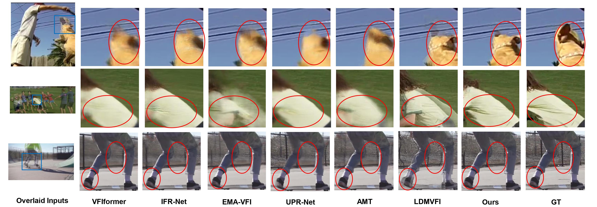
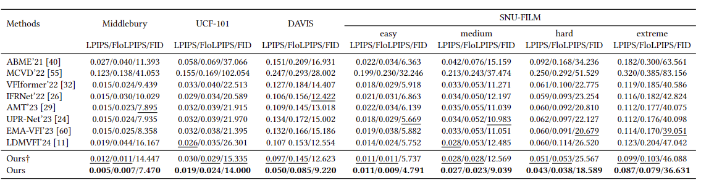
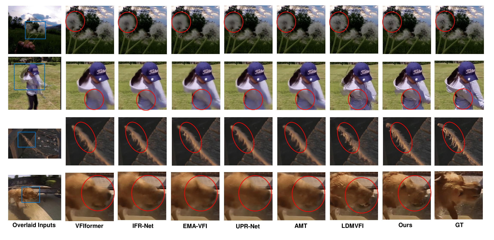

# Frame Interpolation with Consecutive Brownian Bridge

<div align="center">
  
[Zonglin Lyu](https://zonglinl.github.io/), [Ming Li](https://liming-ai.github.io/), [Jianbo Jiao](https://jianbojiao.com/), [Chen Chen](https://www.crcv.ucf.edu/chenchen/)

[](https://zonglinl.github.io/videointerp/) [](https://youtu.be/X3xcYm-qajM)  [](https://arxiv.org/abs/2405.05953)

</div>

<p align="center">

<p>

## Overview
We takes advangtage of optical flow estimation in the autoencoder part and design the Consecutive Brownian Bridge Diffusion that transits among three frames specifically for the frame interpolation task. (a)**The autoencoder with flow estimation** improves the visual quality of frames decoded from the latent space. (b) **The Consecutive Brownian Bridge Diffusion** reduce cumulative variance during sampling, which is prefered in VFI becuase there is a *deterministic groundtruth* rather than *a diverse set of images*. (c) During inference, the decoder recieves estimated latent features from the Consecutive Brownian Bridge Diffusion.

<p align="center">

<p>

## Quantitative Results
Our method achieves state-of-the-art performance in LPIPS/FloLPIPS/FID among all recent SOTAs. 
<p align="center">

<p>

## Qualitative Results
Our method achieves state-of-the-art performance in LPIPS/FloLPIPS/FID among all recent SOTAs. 
<p align="center">

<p>

For more visualizations, please refer to our <a href="https://zonglinl.github.io/videointerp/">project page</a>.

## Preparation

### Package Installation

To install necessary packages, run:

```
pip install torch==2.1.0 torchvision==0.16.0 torchaudio==2.1.0 --index-url https://download.pytorch.org/whl/cu118

pip install -r requirements.txt
```

### Trained Model

The weights of of our trained model can be downloaded <a href="https://drive.google.com/file/d/1XVEEsyM-GmQIQ0q-e00CG4YTZAOrY36u/view?usp=sharing">here</a>. This is named as ```vimeo_unet.pth```.

The VQ Model (the autoencoder part of the above model) is available <a href="https://drive.google.com/file/d/1qxM7Ek46iHN7wrw-TYkuwf3ptc0JxnFn/view?usp=sharing"> here</a>. This is named as ```vimeo_new.ckpt```.


## Prepare datasets

### Training set
[[Vimeo-90K]](http://toflow.csail.mit.edu/) 

### Evaluation set

[[Middlebury]](https://vision.middlebury.edu/flow/data/) | [[UCF101]](https://drive.google.com/file/d/0B7EVK8r0v71pdHBNdXB6TE1wSTQ/view?resourcekey=0-r6ihCy20h3kbgZ3ZdimPiA) | [[DAVIS]](https://drive.google.com/file/d/1tcOoF5DkxJcX7_tGaKgv1B1pQnS7b-xL/view) | [[SNU-FILM]](https://myungsub.github.io/CAIN/)

You should download *other-color-towframes.zip* and *other-gt-interp.zip* in Middlebury.

The DAVIS dataset is preprocessed with the dataset code from [LDMVFI](https://github.com/danier97/LDMVFI/blob/main/ldm/data/testsets.py) and saved in a structured file. Please feel free to directly use it, or you may use the dataloader from LDMVFI.

Data should be in the following structure:

```
└──── <data directory>/
    ├──── MidB/
    |   ├──── input/
    |   |   ├──── Beanbags/
    |   |   ├──── ...
    |   |   └──── Walking/
    |   └──── gt/
    |       ├──── Beanbags/
    |       ├──── ...
    |       └──── Walking/
    ├──── UCF/
    |   ├──── 1/
    |   ├──── 11/
    |   ├──── ...
    |   └──── 3781/
    ├──── DAVIS/
    |   ├──── bear/
    |   ├──── ...
    |   └──── walking/
    ├──── SNU-FILM/
    |   ├──── test-easy.txt
    |   ├──── ...
    |   └──── test/...
    └──── vimeo_triplet/
        ├──── sequences/
        ├──── tri_testlist.txt
        └──── tri_trainlist.txt
```

You can either rename folders to our structures, or change the the codes.


### Evaluate

Please edit the configs file in ```configs/Template-LBBDM-video.yaml```! 

change data.eval and data.mode to decide which dataset you want to evaluate. eval is chosen from {"UCF", "MidB", "DAVIS","FILM"} and mode is from {"easy","medium","hard","extreme"}

Change data.dataset_name to create a folder to save sampled images. You will need to distinguish different difficulty level for SNU-FILM when you evaluating SNU-FILM. For example, in our implementation, we choose from {"UCF", "MidB", "DAVIS","FILM_{difficulty level}"}. The saved images will be in ```results/dataset_name```

Then please run:

```
python3 main.py --configs/Template-LBBDM-video.yaml --gpu_ids 0 --resume_model /path/to/vimeo_unet --sample_to_eval

python3 batch_to_entire.py --latent --dataset dataset_name --step 10

python3 copy_GT.py --latent --dataset dataset_name

python3 eval.py --latent --dataset dataset_name --step 10
```

The ```main.py``` will print PSNR/SSIM in the terminal. The dataset_name is the one shown in ```configs/Template-LBBDM-video.yaml```. 

vimeo_unet is provided as our trained model. /your/dataset is


## Acknowledgement

We greatfully appreaciate the source code from [BBDM](https://github.com/xuekt98/BBDM), [LDMVFI](https://github.com/danier97/LDMVFI), and [VFIformer](https://github.com/dvlab-research/VFIformer)

## Citation

If you find this repository helpful for your research, please cite:

```
@misc{lyu2024frame,
      title={Frame Interpolation with Consecutive Brownian Bridge Diffusion}, 
      author={Zonglin Lyu and Ming Li and Jianbo Jiao and Chen Chen},
      year={2024},
      eprint={2405.05953},
      archivePrefix={arXiv},
      primaryClass={cs.CV}
}
```
